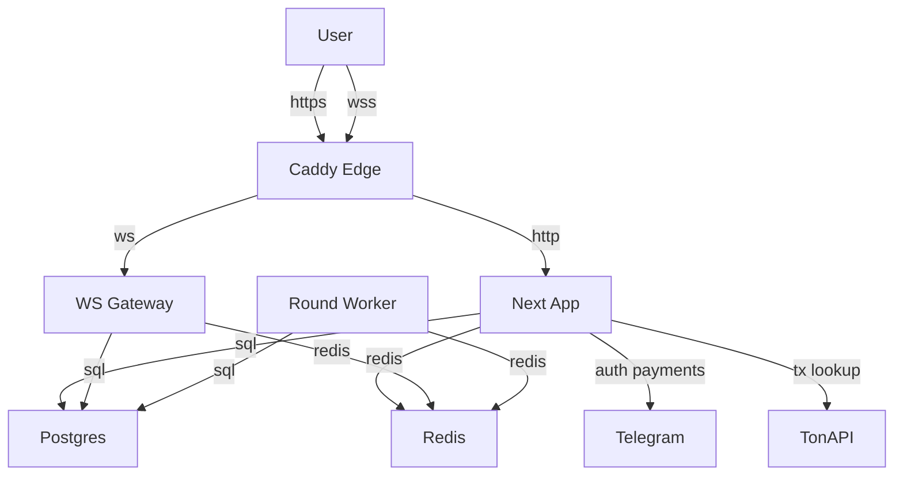

Assumption-validation check-in:

- Предполагаю, что `TON`, `STARS`, staking rewards и house bankroll имеют прямую денежную или high-value игровую ценность.
- Предполагаю internet-exposed deployment через `edge`/Caddy, а не прямой публичный доступ к `app`, `gateway` и `worker`.
- Предполагаю, что основной злоумышленник это обычный аутентифицированный игрок без админ-доступа, без доступа к БД и без компрометации Telegram/TON провайдеров.
- Предполагаю single-tenant модель кошельков и house bankroll без tenant isolation.
- Предполагаю, что `ALLOWED_WS_ORIGINS`, `INTERNAL_API_KEY`, webhook secret и payment signing secret на проде задаются через env.

Вопросы, которые могут materially поменять приоритетность:

- Балансы `TON/STARS` и staking rewards отражают реальные деньги или только тестовую/игровую ценность?
- Есть ли несколько worker/gateway экземпляров в проде или сервис жёстко single-instance?
- Реально ли приложение доступно только через Caddy, или `app`/`gateway` где-то торчат напрямую в интернет?

Ниже threat model составлен без ожидания ответа, под указанными assumptions.

## Executive summary

Главные риски репозитория связаны не с классическим RCE/SQLi, а с нарушением целостности игровой экономики: конкурентные staking-операции могут накрутить баланс, cashout около crash-point имеет race на пользу игрока, а часть boundary checks fail-open при конфигурационной ошибке. Наиболее важные зоны для ручного review: `services/staking.service.ts`, `services/game-settlement.service.ts`, `workers/round-worker.ts`, `gateway/server.ts`, `app/api/auth/telegram/route.ts`.

## Scope and assumptions

- In-scope paths:
  - `app/api/**`
  - `gateway/**`
  - `workers/**`
  - `services/**`
  - `lib/**`
  - `prisma/schema.prisma`
  - `infra/caddy/Caddyfile`
  - `docker-compose.yml`
- Out-of-scope:
  - CI/CD security hardening beyond brief ownership note
  - third-party provider internals (Telegram OAuth/JWKS, TonAPI, Telegram payments backend)
  - Telegram client / browser runtime specifics beyond standard cookie/WebSocket behavior
- Assumptions:
  - Edge traffic идёт через Caddy, который режет `/api/ledger/internal/*`, `/api/payments/ton/reconcile`, `/api/dev/*` (`infra/caddy/Caddyfile`).
  - Runtime состоит из Next.js app, WebSocket gateway, отдельного round worker, Postgres и Redis (`docker-compose.yml`, `README.md`).
  - Auth идёт через Telegram login/initData и opaque session cookie (`app/api/auth/telegram/route.ts`, `lib/session.ts`, `gateway/auth/ws-auth.ts`).
- Open questions that would materially change risk ranking:
  - Реальная денежная ценность балансов и staking reserve.
  - Multi-instance deployment для gateway/worker.
  - Насколько часто в production доступны прямые внутренние сервисы или обход Caddy.

## System model

### Primary components

- `edge`/Caddy: публичная точка входа, TLS, basic auth для `/admin*` и `/api/admin*`, блокировка некоторых internal routes. Evidence: `infra/caddy/Caddyfile`, `README.md`.
- `app`/Next.js: HTTP API для auth, wallets, payments, game actions, staking, admin. Evidence: `app/api/**`, `docker-compose.yml`.
- `gateway`: cookie-authenticated WebSocket канал для live multiplayer actions и round feed. Evidence: `gateway/server.ts`, `gateway/auth/ws-auth.ts`.
- `worker`: lifecycle round-ов, multiplier updates, crash/finish, settlement trigger, reconciliation on startup. Evidence: `workers/round-worker.ts`, `services/game-round.service.ts`.
- `Postgres`: source of truth для пользователей, кошельков, ledger, rounds, players, deposits, staking. Evidence: `prisma/schema.prisma`.
- `Redis`: current round state, multiplier, lightweight locks, rate-limit backing, pub/sub. Evidence: `lib/redis.ts`, `lib/rate-limit.ts`, `lib/redis-lock.ts`, `services/game-round.service.ts`.
- External providers:
  - Telegram Mini App auth / Telegram Login / payment webhooks. Evidence: `app/api/auth/telegram/route.ts`, `app/api/admin/auth/telegram/route.ts`, `app/api/telegram/webhook/route.ts`.
  - TonAPI for TON transfer reconciliation. Evidence: `lib/payments/ton.service.ts`, `lib/payments/ton-reconcile.service.ts`.

### Data flows and trust boundaries

- Internet/User -> Caddy edge -> Next.js app
  - Data: auth payloads, wallet/payment actions, staking requests, admin actions.
  - Channel: HTTPS.
  - Security guarantees: TLS at edge; basic auth on admin routes; app-layer cookie auth.
  - Validation: `zod` in many route handlers; admin write routes add Origin + CSRF checks.
- Internet/User -> Caddy edge -> WebSocket gateway
  - Data: `bet`, `cashout`, `ping`, live round feed.
  - Channel: WSS.
  - Security guarantees: cookie session via `authenticateWs`; optional origin allowlist.
  - Validation: `zod` schema for WS payloads, in-memory per-user rate limiter.
- App/Gateway/Worker -> Postgres
  - Data: wallet balances, ledger entries, rounds, staking state, admin audit, payment intents.
  - Channel: internal DB connection.
  - Security guarantees: transaction boundaries, some explicit `FOR UPDATE`, some uniqueness constraints.
  - Validation: application invariants only; several critical financial flows depend on correct locking.
- App/Gateway/Worker -> Redis
  - Data: rate-limit buckets, distributed locks, current round/multiplier, pubsub events.
  - Channel: internal Redis connection.
  - Security guarantees: best-effort lock semantics, no cryptographic integrity.
  - Validation: minimal; app trusts Redis multiplier/current-round state for game UX and parts of settlement.
- App -> Telegram / TonAPI
  - Data: Telegram initData/id_token/webhooks, invoice payloads, TON transaction lookups.
  - Channel: HTTPS to providers.
  - Security guarantees: Telegram signature/JWKS verification, webhook secret token, TonAPI bearer auth.
  - Validation: HMAC/JWT verification, invoice signature checks, transaction matching by addresses/comment/value.

#### Diagram

## Assets and security objectives

| Asset | Why it matters | Security objective (C/I/A) |
| --- | --- | --- |
| User wallet balances (`Wallet.balance`, `lockedBalance`) | Прямой денежный/игровой актив пользователя | I, A |
| House bankroll (`HouseWallet.balance`) | Ограничивает payouts и устойчивость экономики | I, A |
| Round state and crash outcome (`Round`, Redis multiplier/current round) | Определяет честность исхода и право на payout | I |
| Ledger and house ledger | Источник истины для финансовой истории и settlement | I, A |
| Staking positions / unstake requests / reward reserve | Даёт путь к накрутке или краже наград | I, A |
| Session cookies and admin CSRF tokens | Контролируют доступ к игровым и админским действиям | C, I |
| Payment intents / provider events | Нужны для корректного кредитования депозитов | I |
| Admin audit log | Критичен для расследования инцидентов и идемпотентности admin actions | I, A |

## Attacker model

### Capabilities

- Может регистрировать обычные пользовательские аккаунты через Telegram auth.
- Может слать много параллельных HTTP/WS запросов со своего аккаунта.
- Может экспериментировать с размерами ставок, timing around crash, referral payloads.
- Может атаковать из браузера/стороннего сайта, если boundary checks fail-open.
- Может провоцировать ошибки учёта, если worker/gateway рестартует или работает в overlap.

### Non-capabilities

- Не предполагается доступ к БД, Redis, env secrets или внутренней сети.
- Не предполагается компрометация Telegram signing/JWKS, webhook secret или TonAPI bearer token.
- Не предполагается админский доступ по умолчанию.

## Entry points and attack surfaces

| Surface | How reached | Trust boundary | Notes | Evidence (repo path / symbol) |
| --- | --- | --- | --- | --- |
| Telegram Mini App login | `POST /api/auth/telegram` | User -> App | Создаёт сессию и referral attribution | `app/api/auth/telegram/route.ts` |
| Game HTTP bet | `POST /api/game/bet` | User -> App | Cookie-auth, rate-limited, mutable economy action | `app/api/game/bet/route.ts` |
| Game HTTP cashout | `POST /api/game/cashout` | User -> App | Cookie-auth, mutable economy action | `app/api/game/cashout/route.ts` |
| WebSocket `/ws` | Browser WS | User -> Gateway | `bet/cashout` over cookie-authenticated WS | `gateway/server.ts`, `gateway/auth/ws-auth.ts` |
| Staking claim/stake/unstake | `POST /api/staking/*` | User -> App | Directly changes balances and staking state | `app/api/staking/*.ts`, `services/staking.service.ts` |
| TON intent/submit/status | `POST /api/payments/ton/*`, `GET /api/payments/intents/[id]` | User -> App -> TonAPI | Deposit lifecycle, tx reconciliation | `app/api/payments/ton/*.ts`, `lib/payments/ton-reconcile.service.ts` |
| Telegram Stars webhook | `POST /api/telegram/webhook` | Telegram -> App | Provider event ingestion, deposit credit | `app/api/telegram/webhook/route.ts` |
| Admin auth + write actions | `/api/admin/**` | Admin -> App | Telegram login + CSRF + audit log | `app/api/admin/**`, `lib/admin-request.ts` |
| Internal routes | blocked at edge, but callable if app exposed directly | Internal -> App | High-value control endpoints | `infra/caddy/Caddyfile`, `app/api/ledger/internal/create/route.ts` |

## Top abuse paths

1. Balance mint via staking claim race
   1. Игрок копит `pendingReward`.
   2. Параллельно отправляет несколько `POST /api/staking/claim`.
   3. Конкурентные транзакции читают один и тот же `position.pendingReward`.
   4. Несколько `STAKING_REWARD` записей кредитуют кошелёк.
   5. `pendingReward` и `rewardReserve` списываются только один раз или stale-write-ом.
   6. Итог: баланс пользователя растёт сверх допустимого.

2. Balance mint via over-unstake
   1. Игрок параллельно отправляет несколько `POST /api/staking/unstake`.
   2. Все запросы видят отсутствие `PENDING` request и одинаковый `stakedPrincipal`.
   3. Создаются несколько `StakingUnstakeRequest` на сумму больше реального депозита.
   4. После cooldown mature processing кредитует кошелёк по каждому request.
   5. Итог: из staking выводится больше, чем реально застейкано.

3. Post-crash cashout
   1. Игрок ловит момент около реального crash point.
   2. Worker уже пишет multiplier в Redis, но ещё не перевёл раунд в `CRASHED`.
   3. Игрок шлёт `cashout`.
   4. Settlement видит `RUNNING`, читает уже “поздний” multiplier и начисляет profit.
   5. Итог: payout проходит после фактического проигрыша.

4. Fairness oracle through risk caps
   1. Игрок в waiting phase посылает ставки разного размера.
   2. Risk-engine использует скрытый `serverSeed` и отвечает accept/reject.
   3. По границе acceptance attacker получает сигнал о реальном risk multiplier.
   4. Игрок ставит только в “выгодные” раунды или пропускает “плохие”.

5. Cross-site WebSocket hijack on misconfig
   1. `ALLOWED_WS_ORIGINS` пуст или сломан.
   2. Внешний сайт открывает WS к `/ws` жертвы.
   3. Cookie session проходит в gateway auth.
   4. Attacker script инициирует `bet`/`cashout` от имени жертвы.

6. Referral fraud through unsigned fallback
   1. Клиент логинится впервые.
   2. Вместо Telegram-signed `start_param` подставляет `body.startParam`.
   3. Сервер сохраняет произвольный `referredById`.
   4. Дальнейшие депозиты генерируют reward не по реальному referral flow.

7. Queued-bet accounting break after worker restart
   1. Игрок ставит queued bet, средства lock-аются.
   2. Worker рестартует и reconciliation пересчитывает `lockedBalance`, игнорируя `RoundQueuedBet`.
   3. queued bet остаётся, но lock пропадает.
   4. Дальше возможно нарушение settlement и бесплатная/некорректно учтённая ставка.

8. False social proof via queued-bet event spoof
   1. Игрок делает queued bet по WS во время running round.
   2. Gateway публикует `PLAYER_BET`, хотя active bet не создан.
   3. UI и event log показывают ставку в текущем раунде.
   4. Итог: манипуляция perception и загрязнение audit trail.

## Threat model table

| Threat ID | Threat source | Prerequisites | Threat action | Impact | Impacted assets | Existing controls (evidence) | Gaps | Recommended mitigations | Detection ideas | Likelihood | Impact severity | Priority |
| --- | --- | --- | --- | --- | --- | --- | --- | --- | --- | --- | --- | --- |
| TM-001 | Authenticated player | Наличие pending rewards | Параллельные `staking/claim` до stale write | Накрутка баланса и reward drain | Wallets, staking reserve, ledger integrity | Auth + route rate limit (`app/api/staking/claim/route.ts`) | Нет row locks на position/pool; idempotency по времени | `FOR UPDATE` на position/pool, claim nonce/versioning, concurrency tests | Алерт на >1 `STAKING_REWARD` за короткое окно по user/pool | high | high | critical |
| TM-002 | Authenticated player | Положительный staking principal | Параллельные `staking/unstake` создают over-commit requests | Вывод больше реального stake | Wallets, staking reserve, position integrity | Auth + route rate limit (`app/api/staking/unstake/route.ts`) | Нет serialisation и DB invariant для pending requests | Lock position/pool, unique partial index на pending unstake, invariant tests | Алерт на sum pending unstake > principal | high | high | critical |
| TM-003 | Authenticated player with timing | Раунд близок к crash point | Cashout по multiplier, уже невалидному по правилам | Неправомерный payout | Wallets, house bankroll, fairness | Row lock on `Round`; player uniqueness | Settlement не сравнивает multiplier с crash point; worker публикует multiplier до crash | Atomically gate cashout against crash point; reorder worker state transitions | Алерт на cashout multiplier >= stored crash multiplier | medium | high | high |
| TM-004 | Authenticated player | Risk caps реально ограничивают stake | Bet-size probing для извлечения сигнала о hidden outcome | Обход house edge, unfair advantage | Fairness, house bankroll | Rate limit on `/api/game/bet` | Risk check зависит от secret seed during WAITING | Use only public worst-case bound before round start | Метрика серии rejected bets by same user during WAITING | medium | medium | high |
| TM-005 | External website / browser attacker | `ALLOWED_WS_ORIGINS` пуст или некорректен; жертва залогинена | Cross-site WS commands | Несанкционированные bet/cashout от имени жертвы | User wallets, round participation | Optional origin allowlist; cookie auth | Fail-open when env missing; no additional WS CSRF token | Fail-closed config, signed WS nonce/subprotocol | Лог `ws_origin_rejected`/unexpected origins; commands from novel origins | medium | medium | medium |
| TM-006 | Authenticated player | Первый login | Подмена `body.startParam` | Referral reward fraud | Referral ledger, payout integrity | Telegram initData verification | Referral source partially unsigned | Accept only signed `start_param`; separate referral token signing | Лог `startParamSource=body_fallback` в auth pipeline | high | low | medium |
| TM-007 | Authenticated player + worker restart window | queued bet exists, worker restarts | Leverage reconciliation mismatch to desync lock and queued bet | Free/incorrectly settled future bet | Wallet locks, ledger integrity, queued bets | Startup reconciliation; wallet row lock | `RoundQueuedBet` ignored by reconciliation expected lock model | Include queued bets in expected lock state; add repair path | Alert on queued bet exists while lockedBalance too low | medium | medium | medium |
| TM-008 | Authenticated player | Access to WS betting | Publish fake live bet event for queued bet | Social manipulation, audit poisoning | Event log integrity, player trust | DB uniqueness on active round bet | Gateway ignores `result.mode` | Publish queued event separately or not at all | Alert on `PLAYER_BET` without matching `RoundPlayer` | high | low | medium |
| TM-009 | Operational / deployment overlap | Multiple workers or long tick | Expired lock lets second worker enter round lifecycle | Duplicate active rounds, broken settlement | Round integrity, queued bets, wallet locks | Redis lock exists; health checks; edge single-worker assumption | Lock refreshed once only; no DB uniqueness on active round | Background lock heartbeat + DB unique invariant on active rounds | Alert on >1 active round or repeated lock contention | low | medium | low |

## Criticality calibration

- `critical`
  - Любой путь, где обычный игрок может прямо увеличить свой баланс/вывести больше актива, чем ему положено.
  - Примеры для этого repo: параллельный `staking/claim`, over-unstake с двойным mature payout.
- `high`
  - Любой путь, где игрок получает unjustified positive EV или прямой payout, но с timing/operational preconditions.
  - Примеры: post-crash cashout; secret-outcome oracle через risk caps; cross-user economic action при CSWSH.
- `medium`
  - Любой путь, который искажает вспомогательные выплаты, логику очереди ставок, referral attribution или требует misconfig/restart conditions.
  - Примеры: unsigned referral fallback; queued-bet lock desync; fake live bet event.
- `low`
  - Operational fragility или наблюдаемые риски без прямой exploit path для обычного игрока.
  - Примеры: worker lock overlap при нескольких экземплярах; ownership bus factor 1 на auth-коде.

## Focus paths for security review

| Path | Why it matters | Related Threat IDs |
| --- | --- | --- |
| `services/staking.service.ts` | Главный денежный риск: claim/unstake concurrency и stale writes | TM-001, TM-002 |
| `app/api/staking/claim/route.ts` | Публичный entrypoint к reward credit path | TM-001 |
| `app/api/staking/unstake/route.ts` | Публичный entrypoint к unstake request creation | TM-002 |
| `services/game-settlement.service.ts` | Cashout settlement и wallet credit path | TM-003 |
| `workers/round-worker.ts` | Порядок публикации multiplier/crash и lifecycle lock | TM-003, TM-009 |
| `services/game-risk.service.ts` | Hidden-outcome oracle до старта раунда | TM-004 |
| `gateway/server.ts` | Cookie-authenticated WS и optional origin check | TM-005 |
| `gateway/auth/ws-auth.ts` | Привязка WS к session cookie | TM-005 |
| `app/api/auth/telegram/route.ts` | Referral assignment and session creation | TM-006 |
| `services/reconciliation.service.ts` | Startup repair логика для locked balances | TM-007 |
| `services/game-betting.service.ts` | queued bet lifecycle и locked funds | TM-007, TM-008 |
| `gateway/handlers/bet.handler.ts` | Неверная публикация `PLAYER_BET` для queued bet | TM-008 |
| `app/api/game/bet/route.ts` | Контрольный эталон правильной публикации только для active bets | TM-008 |
| `prisma/schema.prisma` | Отсутствие DB invariants на часть экономических состояний | TM-002, TM-009 |
| `infra/caddy/Caddyfile` | Boundary for internal/admin routes and edge-only assumptions | TM-005 |
